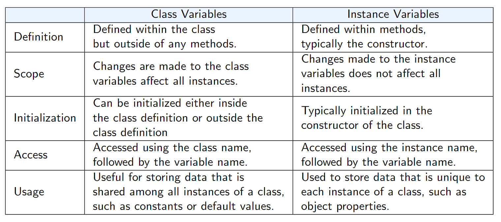

# Lecture 1
- `print(type(var))` prints the type of the data the variable is storing
- **List Comprehension**: Simplifies list operation
	- Syntax: `new_list_name = [ <expression> for <element> in <list-name> if <condition> ]`
	```python
	# Original
	alist = [0,1,2,3,4]
	squred = []
	for x in alist:
		squared.append(x ** 2)

	# Better Version
	blist = [0,1,2,3,4]
	squared1 = [x**2 for x in alist]
	squared2 = [x**2 for x in alist if x % 2 == 0] 
		# Can add if statements
	```
- **Dictionary Comprehension**: 
	- Dictionary syntax: `{a : b, c : d}`
	- Keys cannot be identical, otherwise the newer one will replace the original one.
		- Values can be identical to another value
	```python
	alist = [0,1,2,3,4]
	adict = {x: x**2 for x in alist if x % 2 == 0}
	```
- **Set Comprehensions**:
	- Set: A collection of elements with no duplicates
	- Tuples can have duplicates
		- e.g. `tup = (1,2,3,3,5)`
	- Syntax: 
	```python
	nums = {int(sqrt(x)) for x in range (30)} # 0 to 29
	# range(30) is not returning a list!
	# Its type is <range>
	
	# int(sqrt(2)) will be discarded 
	# because integer 1 is already in the set
	
	```
- Difference between list and set: Set can have no duplicates
- **Tuples**: Immutable (Cannot modify after defined), order of the values matter and can include duplicates
- Difference between list and tuples: Tuples can be used as **keys** in dictionary and as **elements** in sets, while lists cannot.
	- e.g. `dict = {(x,x+1) : x for x in range(10)}`
		- This generates a dictionary: (0,1):0, (1,2):1, ...
	- `print(dict[(5,6)]` results 5
- **Parallel Iteration**: 
	- The `zip()` function takes 2 or more lists and combine the elements in the same index into one group
	```python
	fruit = ['apple', 'banana', 'orange']
	color = ['red' , 'yellow', 'orange']
	for name, color in zip(fruit, color):
		print(name, 'is' , color)

	# results: 
	# apple is red
	# banana is yellow
	# orange is orange
	```
	- If length of the lists are different, then it will discard the elements that cannot be zipped (only zip the ones that CAN form pairs)
- **Functions**:
	- The `*` indicates it **accepts tuples**
	```python
	def print_data(*data):
		print("The data containing: " + data[2])

	print_data("john","Male", 24)
	# Cannot have double paranthesis!
	```
	- The `**` indicates it **accepts dictionary**
	```python
	def print_kids(**data):
		print("The youngest child is: " + data["fname"])

	print_kids(fname = "apple", lname = "banana")
	#Note the keys don't have apostrophe
	```
- **Object Oriented Programming**:
	1. Class
	2. Objects
	3. Inheritance (Not covered)
	4. Polymorphism (Not covered)
	5. Dynamic Binding (Not covered)
- **Class**: Used to define a new data type
	- *variables* (Instant Variables) and *functions* (methods) can be included inside class
	```python
	class Person:
		def __init__(self): # Constructor
		# Define variables inside the class
		# Parameter list must have self in class as the first parameter
			self.name = "AAA" #public 
			self.gender = 'M' #public 
			self._age = 20 # 1 underscore is PROTECTED 
			self.__girlfriend = 5 # 2 underscores is PRIVATE
			
			# Private var can only be accessed by functions within the same class but not outsiders

		def sayhaha(self):
			print("Haha")

		def get_gf(self):  # Accessor
			return self.__girlfriend

		def set_gf(self, n): # Mutator
			self.__girlfriend = n

	haha = Person() # An OBJECT haha with type Person

	haha.name = "BBB"
	# Public var allows modification
	
	haha.girlfriend = 0 # SYNTAX ERROR!
	
	haha.__girlfriend = 0
	# Python makes variables private by RENAMING that variable
	# This line won't give error!
	# But instead it creates a new variable __girlfriend to store the data inside the class

	haha.__girlfriend #ERROR! C++ allows declaration but Python does not

	# To access the REAL private __girlfriend:
	haha._Person__girlfriend = 0 #Adds _Person before the __var


	print(haha.get_gf()) # Prints the __girlfriend value

	haha.set_gf(6)
	```
- Another Example:
	```python
	import math # Library

	class Circle:
		def __init__(self, radius = 3): # Using default value 3
			self.radius = radius
		
		def area(self):
			return math.pi * self.radius * self.radius
		
		def circumference(self):
			return 2 * math.pi * self.radius
	
	mycircle = Circle(10) # Defines a circle with radius 10
	mycircle.radius = 100 # Modifies the radius to 100
	# radius is public so modification allowed

	print("Area: " , mycircle.area()) #Use , instead of +
	# Calls the area() method defined inside Circle

	print("Circumference: " + str(mycircle.circumference()))
	# Calls the circumference() method defined inside Circle
	```
- You can define a *Private* method (Helper Function) inside the class by adding prefix `__`
  - e.g. `__set_default(self):`
  - It only serves other methods within that class
- **Class Variables**: `static` in C++
  - A variable inside class that is not defined in `__init__(self)`
  - It only maintains **1** copy in the program!
  - Usage : `class_name.class_var`
  ```python
  class Person:
	num_person = 0 #Class varaible
	def __init__(self):
		self.a = 1 #Instant variable

		Person.num_person = Person.num_person + 1 
		# Person.num_person++ is INVALID!

	# Only 1 num_person saved in memory, 
	# But how many variable a depends on how many objects created

	print("Total people: " , Person.num_person)
  ```
- Summary:
	